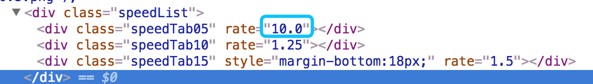

# 智慧树 懒人加速 课程

## 使用方法

* 打开需要加速的视频，切记直接进入的，如果从其他视频的列表中进入请先刷新。
* 复制 `zhihuishu.js` 中的代码，打开 `chrome` ，在console中粘贴代码，回车。
* 在播放器，播放速度选择中，使用选择工具，将任意栏的速度改成10（不得大于10）。





* 重新点击就可以加速

## 加速效果


* 可以加速10倍


## 非常简单的原理


在智慧树的某关键JS文件中[videoList.js](http://study.zhihuishu.com/web/scripts/learning/videoList.js?v=20180328) 是完全明文的（甚至有开发者的名字留下）把智慧树计算时间和弹出问题的逻辑说得比较清楚，希望定制的同学可以研究。[2018年3月]


我们发现在第913行可以发现

```js
	}, playbackRate:function (rate) {
    playRate = rate > 1.5 ? 1.5 : rate;
```

> 这里智慧树的新版本加了一个三目运算来假装限制视频播放组件的速度


因此本代码就是这个文件修改了这块的内容，比较懒QAQ
